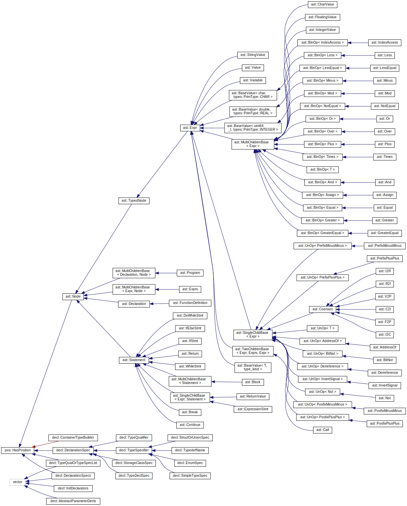
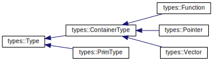

# Relatório CP2 — Grupo DOPE

## Organização dos módulos

| Módulo       | namespace |                                                   |
| ------------ | --------- | ------------------------------------------------- |
| positions    | pos       | Representação das posições dos tokens na entrada. |
| strtable     | strtb     | Tabela de strings.                                |
| symtable     | symtb     | Tabela de símbolos.                               |
| types        | types     | Representação de tipos.                           |
| ast          | ast       | Implementação da árvore de sintaxe.               |
| declarations | decl      | Tratamento de declarações.                        |
| operations   | ops       | Tratamento de operações, type checking etc.       |
| parsing      | parsing   | Código auxilixar para o parser.                   |
| util         |           | Utilidades no geral.                              |
| global       |           | Variáveis compartilhadas por vários módulos.      |

## AST

Para esta etapa, decidimos começar parte da implementação da AST para adquirir
uma noção melhor de como deveriam ser as estruturas das tabelas de símbolos.

Devido a um profundo desgosto com soluções com pouca _type-safety_, optamos por
tentar implementar uma AST com os nós tipados adequadamente. Isso acabou por
resultar em uma hierarquia interessante de classes para representear os nós da
AST, como é possível ver na figura.



Entendemos que isso facilitará a manipulação dos nós da AST, uma vez que, por
exemplo, todos os nós envolvidos em operações com expressões tem o tipo `Expr` e
portanto tem uma estrutura em comum e sabe-se que um método como `get_type()`
pode ser chamado para obter o tipo da expressão.

Implementamos nos nós da AST - através do métodos `write_repr()` e overload do
operador `<<` - a capacidade de produzir uma representação da subávore no
formato de "s-expression". O executável compilado em `bin/render-ast` tem a
função apenas de produzir essa representação para um dado um programa de
entrada. Ele é executado durante a bateria de testes (em `./run_tests.sh`) para
cada arquivo de entrada de teste, e os arquivos que tem entrada bem formada tem
a sua "s-expression" resultante renderizada pelo script `tree2dot` para um
diagrama no formato "dot", do [`graphviz`][graphviz], na pasta `tests/ast-dot/`.

[graphviz]: graphviz.org

\newpage

## Tipos

Decidimos resumir os tipos primitivos a apenas 4 possibilidades de
implementação:

- `void`
- `char`
- `integer`, que engloba os tipos `short`, `int`, `long`, `long long`, com sinal
  e sem sinal
- e um tipo `real`, que representa os tipos de ponto flutuante `float` e
  `double`

bastando usar na implementação as representações correnpondentes com a maior
quantidade de bits.

Decidimos limitar o suporte a apenas vetores de tamanho conhecido em tempo de
compilação, e funções com número fixo de argumentos, i.e. omitiremos o suporte a
"varargs". Também foram omitidos enums, structs e unions.

A classe ContainerType define um tipo que tem um outro tipo como base, como
ponteiros e vetores. Por exemplo, o tipo `int*` tem como base o tipo do valor
sendo apontado: `int`. A base de um tipo de função, por sua vez, é o tipo do
valor de retorno.



### Notação em declarações

Tivemos certa dificuldade para compreender como exatamente funciona a notação
das declarações em C, como que cada parte contribui para o tipo resultante que
será associado ao símbolo sendo declarado. Considere o exemplo:

```c
int *vec[4][8];
```

A sintaxe de cada "declarador" pode ser construída iniciando-se com um
identificador — `vec` no exemplo — que pode ser concatenado à direita com
`[<x>]` para formar um declarador de tipo de vetor, sendo `<x>` o tamanho do
vetor; ou `(<params>)`, para um tipo de função, sendo `<params>` os tipos
dos parametros. Um declarador também pode ser concatenado à esquerda com um
asterisco `*` para torná-lo um declarador de tipo de "ponteiro para", sendo que
este tem precedência menor que os concatenados a direita. Naturalmente, um
declarador pode ser rodeado de parênteses para sobrepor essa precedência. Assim,
a expressão acima resolve sintáticamente para:

```c
int *((vec[4])[8]);
```

O que pode fazer um incauto imaginar que o que está sendo declarado nessa linha
é um ponteiro, visto que o `*` está mais por fora que os `[]` de vetor. Porém,
não é que está acontecendo. Ocorre que em C as declarações foram projetadas para
[imitar a sintaxe][bad-pointers] da expressão em que o símbolo sendo declarado
será usado.

Ou seja, em:

```c
int x = *vec[3][7];
int x = *((vec[3])[7]);
```

partindo de `vec`:

- selecionamos a quarta posição do vetor: `vec[3]`;
- então a oitava posição do vetor resultante `vec[3][7]`;
- e por fim derreferenciamos o ponteiro para acessar o valor de tipo `int` que
  será atribuido à variável `x`, no endereço do ponteiro: `*vec[3][7]`;

Observe que navegando "de dentro para fora" na expressão, desconstruímos os
tipos compostos até chegar no tipo base. Isso é o contrário do que queremos
fazer na declaração: a partir do tipo base, construir os tipos compostos.

Então em nossa implementação escolhemos empilhar cada parte dos declaradores e
então desempilhá-lhas para construir o tipo na ordem inversa em que acontecem as
reduções no parser. Empilhando o nosso exemplo da esqueda para direita temos:

    vec => [4] [8] * int

Lendo da esquerda para direita temos:

    vetor de tamanho 4 de (vetor de tamanho 8 de (ponteiro para int))

Portanto desempilhando da direita para esquerda podemos construir o tipo:

    Vetor(4; Vetor(8; Ponteiro(int)))

Como ninguém conseguiu elaborar uma maneira simples de reconstruir essa notação
absurda a partir dos tipos construídos no parser, adotaremos nas representações
dos tipos - em mensagens de erro, no diagrama da AST etc - uma notação
semelhante à pilha do exemplo mostrada acima, pelo menos por hora:

    [4][8]*int

[bad-pointers]: https://www.quora.com/C-programming-language/Why-doesnt-C-use-better-notation-for-pointers
[c-del]: https://eigenstate.org/notes/c-decl
[spiral]: http://c-faq.com/decl/spiral.anderson.html
[so1]: https://stackoverflow.com/a/13592908/1967121
[so2]: https://stackoverflow.com/a/21300975/1967121

## Comportamento curioso nas ações do Bison

Notamos que em algumas ações do nosso parser foi acidentalmente omitida a
atribuição `$$ = $1` onde ela deveria ser necessária, mas o código funcionava
perfeitamente. Note que o Bison fornece uma ação padrão `{ $$ = $1; }`, mas não
é esse o caso. Nós havíamos defindo ações para essas regras, que modificavam
`$$`, porém sem antes atribuir `$$ = $1`. Chegamos à conclusão que isso se deve
a essas regras serem reduzidas exatamente na mesma posição da pilha do parser
onde antes é reduzida a regra que define o valor inicial `$$ = …;`. Por exemplo:

```
program
    : %empty                { $$ = new ast::Program(); }
    | program program-part  { $$->add($2); }
```

## Versão defasada do Bison

Mais uma vez a versão defasada do Bison que vem com o Ubuntu 18 nos causou
transtorno, dessa vez por causa da seguinte feature documentada no [changelog]:

```
2018-08-11  Akim Demaille  <akim.demaille@gmail.com>

	add support for typed mid-rule actions
	Prompted on Piotr Marcińczyk's message:
	http://lists.gnu.org/archive/html/bug-bison/2017-06/msg00000.html.
	See also http://lists.gnu.org/archive/html/bug-bison/2018-06/msg00001.html.

	Because their type is unknown to Bison, the values of midrule actions are
	not treated like the others: they don't have %printer and %destructor
	support.  In addition, in C++, (Bison) variants cannot work properly.

	Typed midrule actions address these issues.  Instead of:

	    exp: { $<ival>$ = 1; } { $<ival>$ = 2; }   { $$ = $<ival>1 + $<ival>2; }

	write:

	    exp: <ival>{ $$ = 1; } <ival>{ $$ = 2; }   { $$ = $1 + $2; }
```

Optamos dessa vez por usar uma versão mais nova do Bison nessas máquinas através
do [gerenciador de pacotes do NixOS][nix].

[changelog]: https://fossies.org/linux/bison/ChangeLog
[nix]: https://nixos.org/guides/install-nix.html
